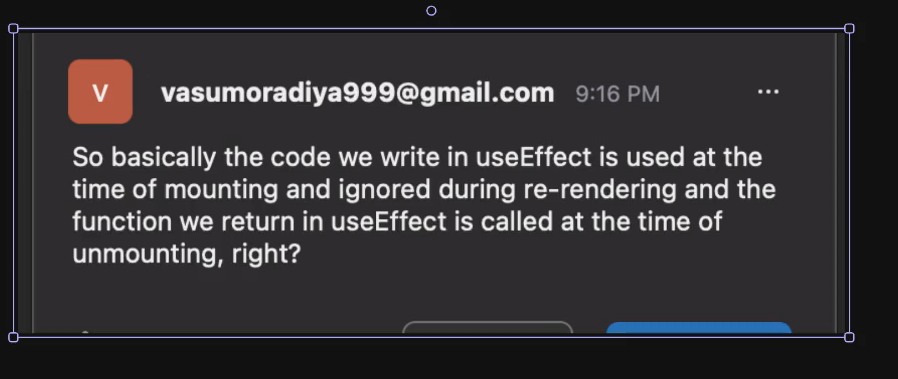
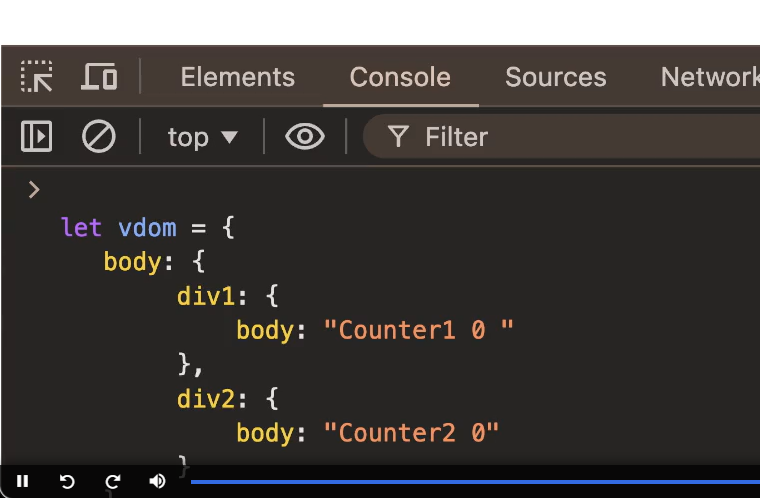

V1 _ we learnt how react works under the hood, written some react similar code through DOM manipulation and did very basic React Coding

Today we will learn
1. useState 
2. useEffect
3. props
4. conditional rendering
5. children
6. lists and keys
7. inline styling
8. class based vs functional components
9. error boundary
10. Fragment 

if we know this then we can write unstyled React App, this is enough before starting to context API and we need to learn about more hooks useState and useCallback and useMemeo

very common way to start react project locally is using VITE :  it is build tool
 -> create react app is 1 way : not recommended
 -> npm create vite@latest

 // USE STATE HOOK
  -> Hook : function that starts from 'use', hooks in react let you hook in side effects

  useState() hook is used to define the state of your application. it is raw hook that react provides
  -> we will also use external hooks that need to be installed

  -> see this about useEffect : 

  -> Virtual DOM : 

  -> florr.io : how to make websites like this : common use case like agarrio
          -> YOU NEED SOME CANVAS LIBRARY
          -> use game engines like : phaser / fazer OR babbleON is one if you want to go 3d
          -> they do collision detection from letting person go from somewhere in UI
          -> A real time backend like websocket server, where everyones position is getting relayed so you are on the same screen synchronised 
          -> 