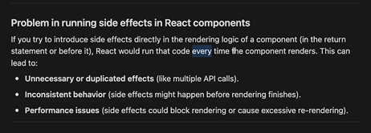
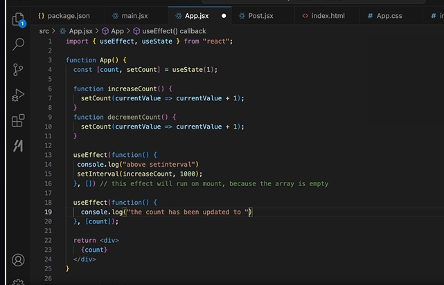

// at the end we will try to build allen.in like website which is SPA

______________________________________________________
START REACT PROJECT LOCALLY
______________________________________________________

We will use Vite -> Build tool for frontend
provides two things  : 
    1. A dev server that provides rich feature enhancements over native ES moduls, for example extremely fast HMR (HOT MODULE REPLACEMENT)
    2. A build command that bundles your code with Rollup, pre-configured to output highly optimised static assets for production

    -> see webpack and bundler.js

    vite is build on top of rollup

    before vite -> create react app was used but now it is deprecated 

    react-dom : renderer for websites
    react-native : renderer for mobile apps

    both use react as framework for diffing [finding difference between old state vs new state]

    HMR breaks if you work in wsl : have some extra configurations done in vite.config.js

    Now Learning basic react topics  to make projects :-
     -> structuring your app in components
     -> Defining state of your app

______________________________________________________________________________________     
COMPONENTS
______________________________________________________________________________________

components are building blocks of UI, allow split UI into independent , reusable pieces that can be thought of cusotm, self contained HTML elements

SO see App.jsx -> did some components and we can see now how easy it is to make frontends now, diff developers and diff UI engineers can work together and then combined or glued together with the help of states

____________________________________________________________________
conditional rendering
____________________________________________________________________

done : promoted or add posts in linkedin basic clone does not show followers or clock icon, just says promoted and in  red color 

____________________________________________________________________
props
____________________________________________________________________
props are the way to pass data from one component to anothet in React

_____________________________________________________________________
useState hook
_____________________________________________________________________

So what is state? why do we need state ? and why do we say designing components is one part and maintaining states is one part

all dynamic bits of the wesbite are : state 
and the actual HTML is called component

_________________________________________________________________
useEffect hook
_________________________________________________________________
App_3.jsx
it lets us manage sideEffects

side Effects : operations that interact with outside world or have effects beyond the components rendering. Example :
   -> fetching the data from an API
   -> modifying the DOM manually
   -> subscribing to events (like webSockets connections, timers, or browser events )
   -> starting a clock 

problem in running side effects in react components : 

see this : 

useEffect lets you perform side effects in functional components in a safe, predictable way

function(tool){
    return tool+1;
}

is SAME AS

tool => tool+1

Strict mode makes sure cleanup code is run everytime
and when strcit mode is off cleanup only runs when required

TWO IMPORTANT THINGS TO LEARN IN USE EFFECT :-
------------------------------------------------------
CLEANUP_LOGIC and DEPENDENCY ARRAY
------------------------------------------------------

1. DEPENDENCY ARRAY----------------------------------------------------- App_4.jsx
  so useEffect hook takes two arguments : 
     => function containing side effects
     => dependency array 

  So, if the dependency array is empty the function will run on mount and it will return a function on unmount

  BUT if DEPENDENCT ARRAY is not empty then the bahviour is different 

  so, let's take an example so, say whenever your notification counter goes up you need to let your backend server know that counter increased or decreased

  now for both cases you will have to add fetch request in increaseCount() and decreaseCount() both thr functions which is not so efficient as you are repeating your code. 
  Now, what you can do is create new useEffect which will monitor thr count variable which is kept inside the dependency array and as soon as it updates will call 1st function where we do a fetch request

  so useEffect with dependency array will run on mount as well as when any variable in dependency array changes

  

  LAZY LOADING : Load the data only when the user requests it or triggers some action to load it, donot load all the data pre-request saving consumption power

2. CLEANUP CODE-------------------------------------------------------------------
 in App.jsx

 so in 1st argument we used the code inside the function but we did not use the return value of this function

 so this 2st argument itself returns the function which does cleanup code for us

  -> imp use case : on linkedin 
  > subscribing on websocket server when swithching tab we need to disconnect to this websocket server of previosu tab

  examples are : zoom or gather.town > 
  
  so gather.town is website where there are virtual spaces, so when you enter room you subscribe to a backend , even better when you and your partner or any number of people are there then you are subscribed to everyones movement , but if you move off from this room to another then you need to unsubscribe from prev room to connect to new room and then its specs will be rendered
    

ASSIGNMENT :

1. Try to create linkedin top bar and randomly update the icon labels of 1,2,3,..   : DONE : App_3.jsx

2. Functional vs class Based components

3. Add Loader in your linkedin resemblance of feed, notifications, .. app.jsx : DONE : App_4.jsx
