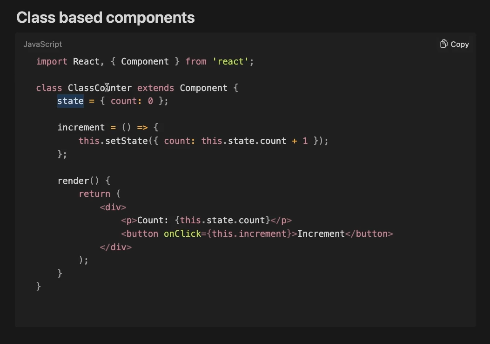
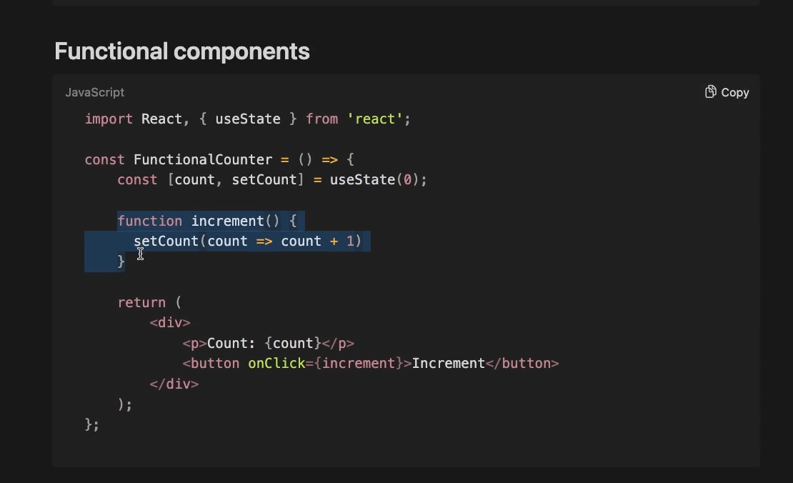
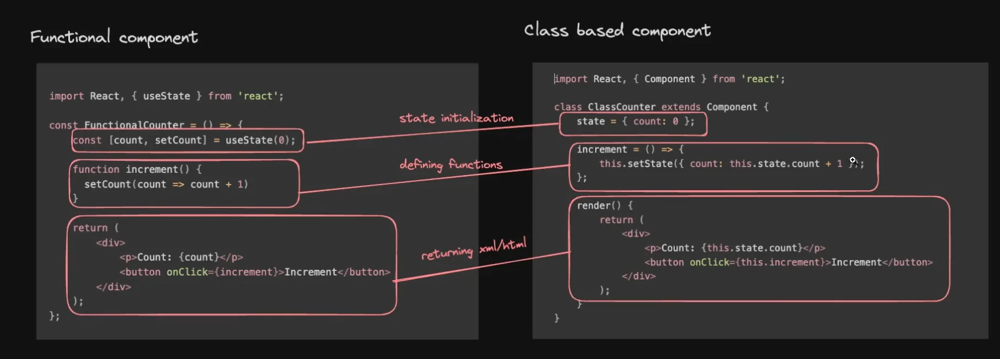
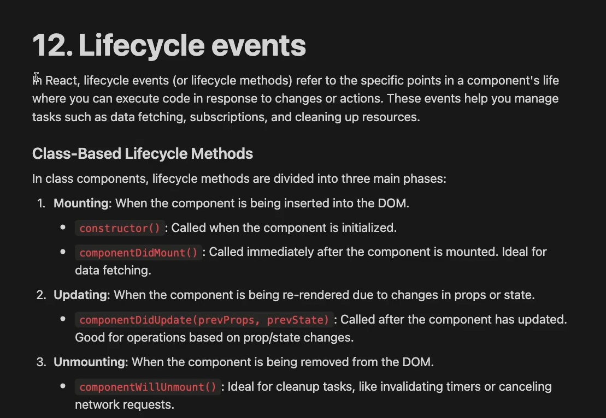
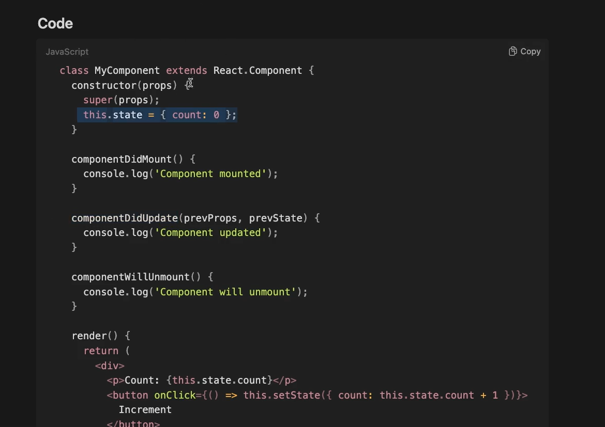

Continuing with react learning 

1. Starting a react project locally             : DONE 
2. components                                   : DONE
3. useState                                     : DONE
4. Tracking re-renders                          : DONE
5. useEffect                                    : DONE
6. props                                        : DONE
7. Conditional Rendering                        : DONE
8. Children                                     : DONE
9. Lists and Keys                               : DONE
10. Inline Styling                              : DONE
11. Class Based vs Functional components        : DONE
12. Lifecycle events                            : DONE
13. Error boundary                              : DONE
14. Fragment                                    : DONE
15. Single Page Applications, routing           : 
16. Layouts                                     : 
17. Building a website                          : 

___________________________________________________________________
children
___________________________________________________________________

children prop allows tou to pass element or component as props to another components

eg - useCase : I ak you to create card component, linkedin create post card, having user Info 
creating generic card component where you can pass internal elements as props

in these kind of useCases children props are useful

SO, see in App.jsx : we use childre prop for these type of useCases when you need to create a wrapper component where you need to enclose all the children content from component to be added dynamically

generic Wrapper component : where you want all kids to get wrapped around as children and then passed down to component as children prop

___________________________________________________________
Lists and Keys
_______________________________________________________

we laready did lists in linkedin posts 

-> see app_3.jsx

________________________________________________________
INLINE STYLE
________________________________________________________
we did it many times 

<!-- function MyComponent() {
  return (
    

      Hello, World!
    

  );
} -->

so in style we give Object which has styles, since it is XML element we have to provide style as object in props, more later in project we will use tailwind instead of CSS to do styling

________________________________________________________________

CLASS BASED COMPONENT and FUNCTIONAL COMPONENTS
________________________________________________________________

open App_4.jsx

legacy concept :

until now we have done functional components

Class components are classes that extend React components while functional components are simpler and can use Hooks

 : here state Variable is defined as sister attribute to the object of this class
and a function for increment is a function and then we use render function to return the XML

different way of incrementing state

earlier class based components was the only way to define components now, functional components have become the norm as they are easy to use and better to maintain. you can still use class Based components as and when required : but you cannot use hooks here, useState(), useEffect() all were made for functional components

_______________________________________________________________________
LIFECYCLE EVENTS
_______________________________________________________________________

these lifecycle events was a proper thing in class based components but in functional components we do this in very ad-hoc way [for particular purpose, not planned before it happens, ad-hoc is often used to describe temporary solutions or improvisations]

MOUNTING, UNMOUNTING and RE-RENDERING

In react lifecycle events (or lifecycle methods) refer to specific points in a components life where you can execute code in response to changes or actions. These events will helo ypu manage tasks such as data fetching, susbcriptions, and cleaning up resources

____________________________________________________________________
ERROR BOUNDARY
____________________________________________________________________

slightly legacy thing

: this is where you have to use class based component only
: we have to use class based component to use this

error boundaries are react componenets that catch JS errors in their child component tree and display a fallback UI

Error boundaries only exist in class based components
 
REAL USE CASE : on youtube dashboard =>  in this image the latest video performer section had the error message showing some error occured and refresh button and even though refresh button presed error did not resolve but you can see even though some component on the website has an error it does not break the whole UI, so correct way of using error boundaries

error boundary : lets you contain errors 

so what might have happened is some API request at that particular card might be failing so it falls back to error boundary component

sO, we are bounding errror, that error won't go out of your UI component and whole application is saved from crash

doing this in : App_5.jsx

_____________________________________________________________________
FRAGMENTS IN REACT
_____________________________________________________________________

very imp sort of mistake that beginners do in REACT is : 

inside app function they return like this : 

return 

which will create a problem as we cannot return : return 2 2

OR 

return "Aayushi" "aayushi"

you cannot two things together

react expects you two return single top level div that wraps all the children 
ERRROR IT SAYS : jsx element must have one parent element

so you do is wrap whole inside one div  : 

return (
    

        

        

    

)

so this works fine but there is still one problem with this that you have introduced on extra div

what if i want react container to have two different divs and no parent div wrapping it : then in that case you can use fragments in react :

return (
    <>
        

        

    </>
)

or you can do : 

import {Fragment} from 'react'

return (
    <Fragment>
        

        

    </Fragment>
)

FRAGMENTS : In React, a component can return a sinfle parent element, but it can contain multiple children within thar single parent

-----------------------------------------------------------------------------------------------------------------------------------------------------------------------------

So we have covered all basic terminologies and foundation for react 

we will learn SPAs, layouts and building a website in live class

 -> after that we will learn 
    => complex state management :  rolling the state to the top of application

    => context API
    => prop drilling 
    => then we will see some framework to do state management : recoil OR redux or mobX or zustand