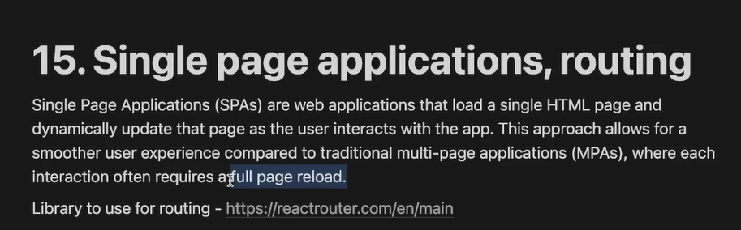
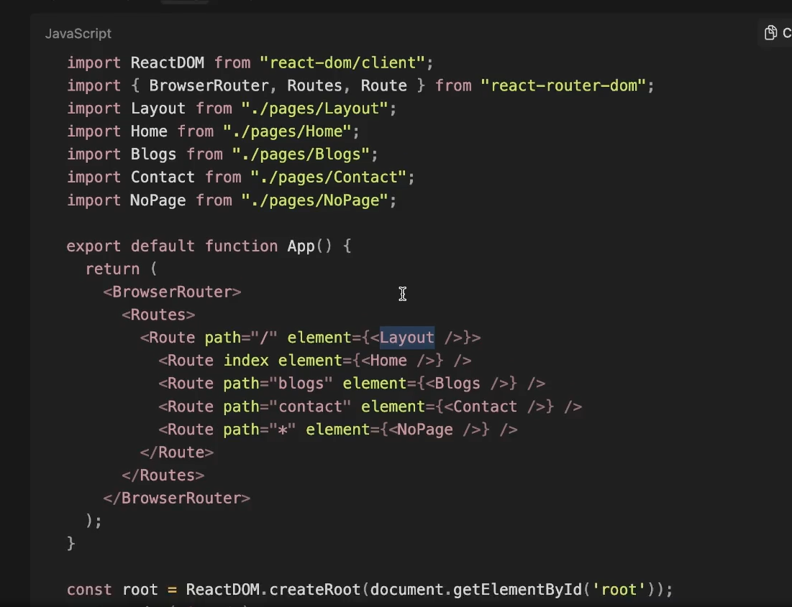
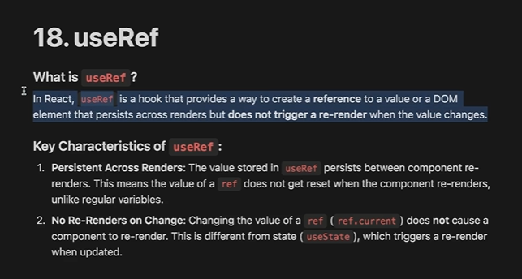
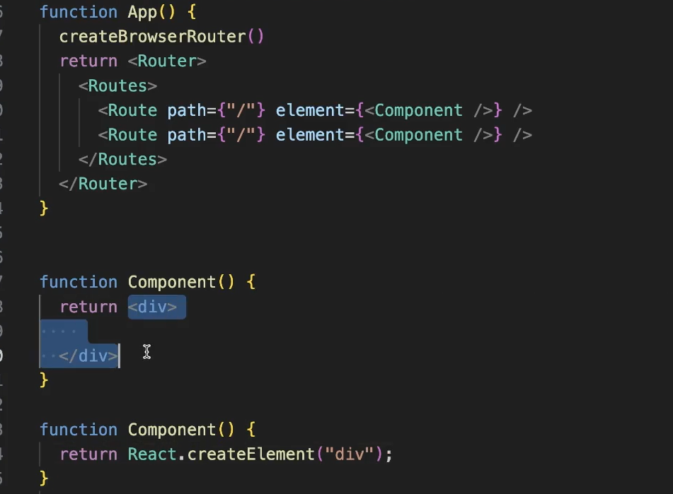

Today we will learn about React Concepts that you will not see in simple projects

but as your application becomes complex then you add them

or you see these in complex codeBase

they are definitely asked in interviews like usefecth custom hook or usePrevious custom hook : we rarely use them but very nice to know

we will learn  : 
  -> SPAs       : DONE
  -> Routing    : DONE
  -> Layouts    : DONE
  -> useRefs    : DONE
  -> Custom Hooks and context API will be learnt in next class

  -------------------------------------------------------
  SPAs and Routing
  -------------------------------------------------------

  Single Page Applications : loads single HTML page and dynamicly updaye the page as user interacts with app

  whatever HTML, CSS and JS if you go to one page to another you refetch the html and render it on browser. So a fresh load of webpage can be seen

  but in SPAs there is no loader that we see, a fresh website does not render only some part of it is loaded on page

  So Allen website is SPA, Linkedin is SPA

  this is great User Experience : since user does not see any white page while getting routed to some other html page

  

  after running npm run dev

  your App.jsx is renderd on http://localhost:1573

  now even if you go to any route it will show you same webpage only so routing is not enabled write now

  rigth now we will use react library that handles routing for us : react-router-dom

  react native also have similar library for navigation in mobile apps : react-navigation

  similarly react might have library for navigation in desktop app like react-route-desktop

  So react is just top level library out of which you can create : web applications, native applications on mobile, desktop applications

  do npm install react-router-dom

Q. What is API of this library ?how can we use this library ?
ans :  so API is farely easy to understand if you understand children props
    => you need to import somethings from react-router-dom
    go to App_1.jsx

--------------------------------------------------------
LAYOUTS : App_2.jsx

we have basically donw this while routing only

Layout : very imp jargon to know when we reach nestJS . We Will Learn , It basically means : It has navBar at Top and 
footer at bottom and eveything in middle changes dynamically

Another better way to do layouts in react is : 

__________________________________________________________________________________________________
useRef Hook
__________________________________________________________________________________________________
move to App_3.jsx

useRef Hook : Another hook in react provides a way to create a reference to a value OR to a DOM element that persists across renders but does not trigger a re-render after the value changes

useRef is hook that allows to create a
It has manily two use Cases one easier to understand one harder , provides way to create a reference to a :-
  ->  DOM element     : an easier concept and very relatable 
  ->  value           : a little harder to understand

UseCases of useRef :-
   => focusing on input box
   => referencing to a value when you change the value, the component does not re-render
   => Scroll to bottom
   => clock with start and stop button : you can do it without ref also but you should build it with refs : tried to do in App_3.jsx  move to App_4.jsx

   there are three ways to define variables in REACT :
      => stateVariable
      => rawVariable
      => refVariable

  Assignment 
  1. you can do routing manually also :  try as assignment
  2. What is this path variable, what happens when we change it 
  3. Do clone Allen Website
  4. Try Scroll to bottom use Case of useRef yourself :
   So, the task is like in messages when new message comes it automatically scrolls down to the page, implement something similar to this
   5. Someone Said redux is a over kill and recoil is better

   PEOPLES DOUBTS ---------------------------------------------------

   1. Client Site Routing : AKA client side rendering, : so it means browser itself have logic to change the route when some particular information is accessed by the user

   2. Client Side Routing vs Server Side Routing
   3. Client Side Rendering vs Server Side Rendering
   4. What is object style routing and create BrowserRouter
   
   5. 

   POWER DYNAMICS WORKS while hiring in BIGGER COMPANIES :
   1. choose tech Stack jo bhut kam hi logon ko aata ho
   2. every tech has lot of money : 
       -> php, wordpress, asp .net , azure has lot of money
       -> mostly money flow is in consultancies 

   3. Higher packages are in : Python, GoLang, or MERN
   4. 