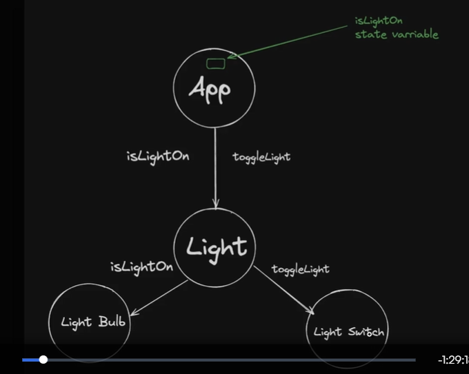
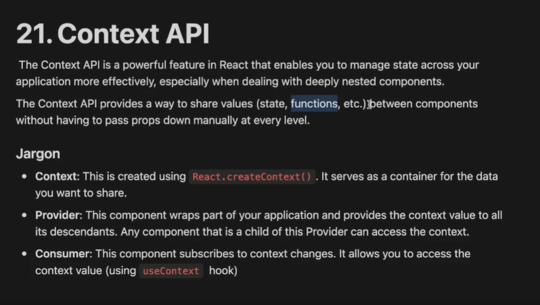
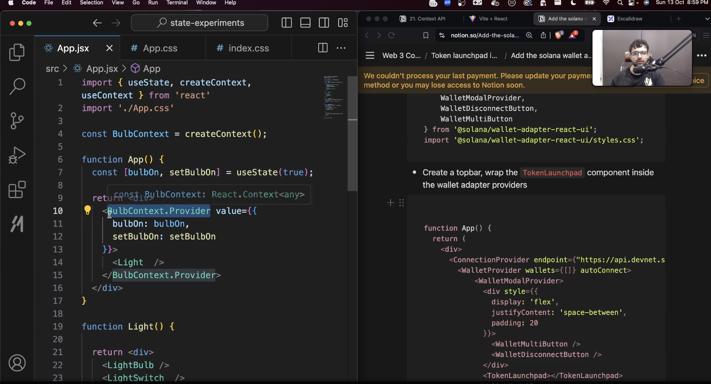
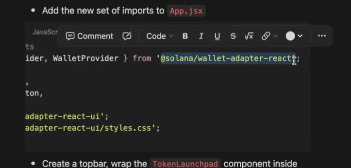

This video : small part of react will finish

Things we need to still learn in react  : 
  -> State Management
  -> interview concepts
  -> after tailwind we can do good websites : we can go for shadcn and how it works under the hood
  -> Custom HOOKs  -> will be taught in offline video as they are hard to digest 

TODAY : We are going to learn state management concepts in react and we will understand Context API => The most crud way to do state management before using state management libraries 

Context APIs : These are most CRUD way of doing state management 

---------------------------------------------------------------------
Rolling up the state, unoptimal re-renders
---------------------------------------------------------------------

This is not exact term but this is something that describes in one word how REACT application does state management

-> till now we know very basic about state Management , we know about useState() hook 

So, State Management is basically managing that state variable

So react apps are easy to write but hard to maintain, it takes more time to manage State in react app, this is where you invest most of your time to make your React app more optimal and relevant for use

RollUp is one thing you can do : roll up the state : but this is bad thing as beginners we tend to do this when they stuck in few places , this is bad because it triggers lots of re-rendering

for smaller app it doesn't matters but for scaling app it causes teething pains

SO :-

as your app grows, you might find that multiple components need access to the same state. Instead of duplicating state in each component, you can lift the state up to the LCA, allowing the common ancestor to manage it  

---------------------------------------------------------------------
Prop Drilling
---------------------------------------------------------------------

props : arguments to the components

prop Drilling : It occurs whrn you need to pass data from a higher level component down to a lower level compoonent that is several layers deep in the component tree. This often leads to the following issues :
  -> Complexity : You may have to pass props through many intermediate components that don;t use the props themselves, just to get them to the component that needs them
  -> Maintenance : It can make the code harder to maintain, as changes in the props structure requires updates in multiple components

WAYS OF FIXING THE PROP DRILLING  :- 

 1. using CONTEXT API : API [application programming interface]  whatever hooks we use here , or watever we import from react is a react API, If I want to work with it the useState is the iterface I use to work with it [the terms are being used here and there but try to understand the essence]  
    -> till now we learnt about useState API, useEffect API now we will learn context API

    -> so context API fixes prop drilling [fixes some thingd and some not for which we use state management libraries like : recoil, redux, mobX or zustand]

Three functions / jargon we have to use when we use context API
[defining fresh context of your app using context API requires you to do these three things :- ]
 -> __Context__   : React.createContext()
 Eg  :   context of chat app => [messages] | context for Twitter => [tweets] | context for Insta => [posts]  | so in our Lightbulb application context is => [bulbState]. It serves as container for data you want to share. [bulbOn, setBulbOn]
 
 context is not created inside your App function it is created ideally in a separate file and thenn imported but for now we will create it out in App.jsx itself

 > move to new App.jsx

 -> __Provider__ : This component wraps part of your app and provides the context value to all its descendants.Any component that is a child of this provider can access the context.

 There are two ways of doing this : 
    -> easier way 
    -> harder way : we will be doing this one

 -> __Consumer__ : using the values inside the context 
      > using context in descendants of the provider

 {
    Step 1 : Creating a context 
    Step 2 : wrapping your component inside provider  : provider wraps part of your application and provides context to all its descendants  and giev it value
    STEP 3 : using context values : {contextVAr} = useContext(contextName)
 }

There is one more thing to add on top ONE MORE ADDITION : we will learn later 

Now if you have understood this, then state management is much more easier you donot have to worry about, this is slightly harder way to do state managemnet .

We will se recoil and zustand are comparitively easy to do redux is somehow complex [it has some whole jargon in itself]

solana real life example of use of context api usage : context provider wrapped code : 

you see that code is much cleaner and does not have .Provider written as in our code. In solana it is some sort of a custom component and our is very clearly statify that we  are using context API provider, so our code does not hide that we are using context

basically if you are creating library in future you won't want to expose your context provider like this .Provider

So ConnectionProvider, WalletProvider come from external library   => 

So, solana don't give you context [they don't export context ] they export a component that under the hood uses context

so hwo to create a similar component : say BulbProvider
which looks more cleaners

// Now do some experiments : this will help you understand why we need state management libraries and why they are better than context APIs > move to App_3.jsx

both provide you similar APIs both make codebase little cleaner but context API doesn't optimise our codebase it doesn't optimise number of re-renders 

but the state management libraries like redux ,recoil, mobX, zustand  :   they optimise re-renders as well

App_3.jsx  => testing re-renders
App_4.jsx  => optimising the code by using state management libraries 

 Q1. So Whta is optimising re-renders ?
 Q2. WHy is it good thing to do?
 Q3. How does these state management libraries do it and context API does not

ASSIGNMENT -------------------------------------------------
   >> use only context API to do state management and prevent not needed re-renders
   >> we can reduce renders using usermemo 
   >>way to optimise re-renders in context api is to use memoAPI, useMemo and React.memo to save on re-renders