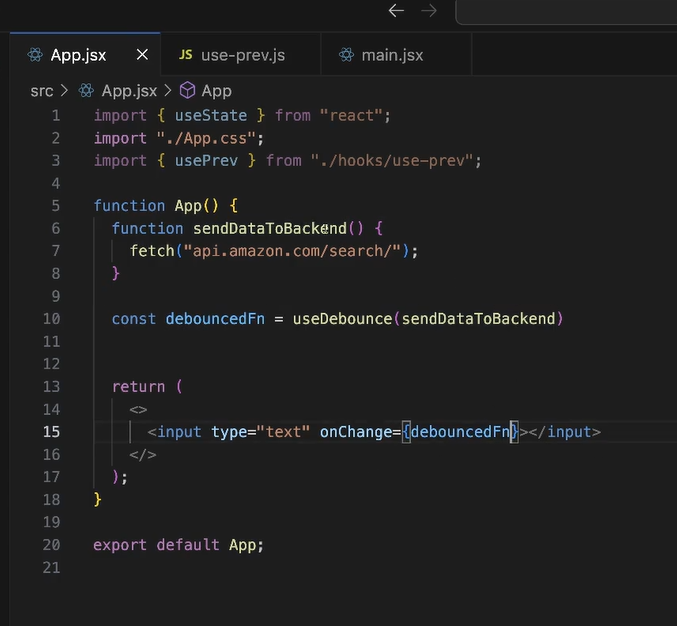
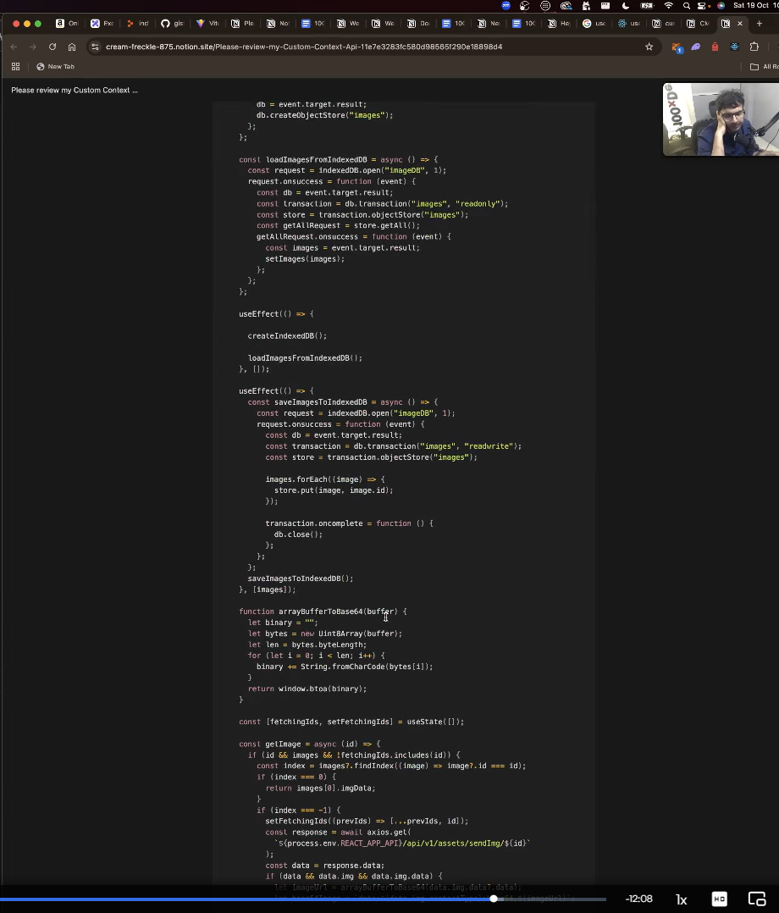
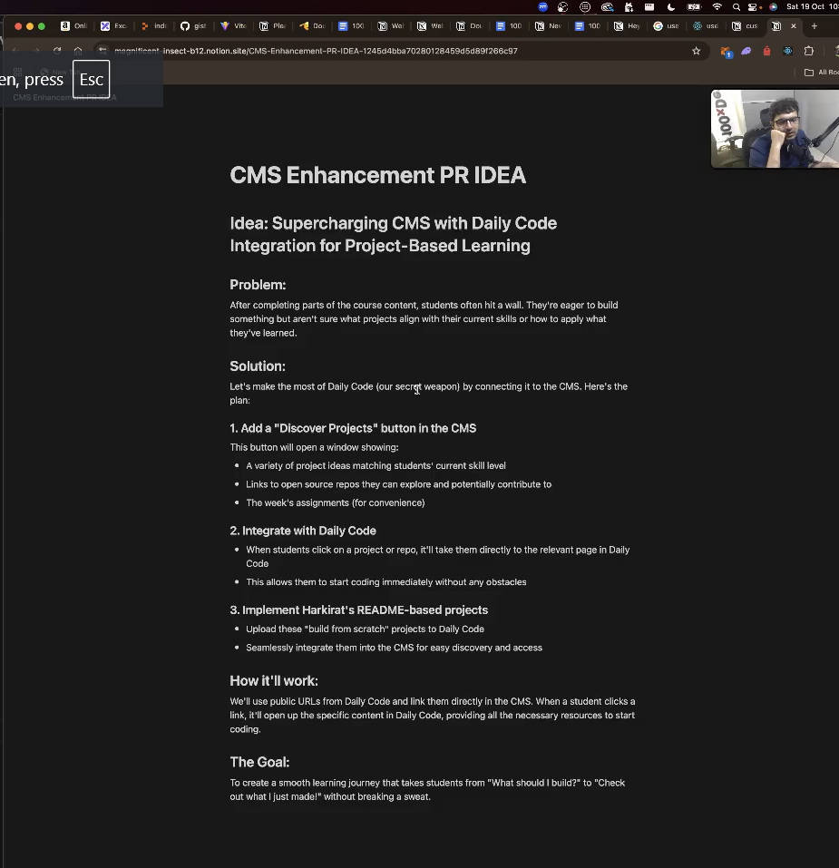

Contuning some left out part from last class
 -> custom hooks

There ar elot of custom hooks that you can create : 
   -> useFetch 
   -> useFetch with re-fetching
   -> usePrev
   -> useIsOnline 
   -> useDebounce

   -----------------------EXTRASS---------------------------
   -> useMemo
   -> useCallback 
   -> useTransition()
   -> use()
and there are more in library called useHooks

What are hooks ?

HOOKS :
1. useState : store a state variable and re render component if its state variable changes
2. useEffect : Run an effect whenever a dependency changes 

CUSTOM HOOKS : We are going to write our own hooks , it is nothing but a function, the only condition is it should start with use 

custom hooks are powerful feature that allows you to encapsulate and reuse the stateful logic across different components

The condition for any function to be hook is :-
    -> start the variable name with use
    -> it should use some another hook inside of it

   eaxmple : function useValue(){
      const [value, setValue] = useState(1);

      return value
   }

-> creating __useCounter__ hook : app_1.jsx                             : DONE
-> Some dummy __usePostHook__   : app_2.jsx                             : DONE
-> creatinf __useFetch__ hook : app_2.jsx  and app_3.jsx                : DONE
   - in web3 class we have grown through library called 
      TanStackQuery and ReactSWR 
   - this useFetch hook is something is doen in these librarie   

-> creating __useFetchRefecth__ hook (with refetch functionality)   : app_4.jsx                  : DONE    

-> __usePrev__ Hook : app_5.jsx : It is hook to get the prior value | cases like : what was last song you played 
This hook is used to get the last value of the state in react.
So it is supposed to show you the prev value of a state variable  : THERE IS SOME PROBLEM WITH THE CODE RIGHT NOW, WE WILL SEE AT THE END OF CLASSS

-> __useDebounce__ Hook : app_6.jsx and app_7.jsx :Debouncing=> It is when you go to amazon.com and type very fast in the search bar then it debounces my http request to their backend server. So, it doesn't send request some 30ms untill I have stopped typing. So debouncing the user requests till user stops to make sure this is the request he wants to send

say mene bhut tez tez : fjneklfkefkjljfjfojfi.... likh diya to esa ni hoga ki vo phle 1st http request 'fj' bhejega backend ko search krne k liye ki 'fj' se kya shuru hota h fir 2nd http request 'ne' bheja ki 'fjne' se kya shuru hota h , NAHI, vo esa nhi krega . Vo kahega tu likhle bhai, jab tu likhlega uske 50mn baad mein backend mein request bhejunga ki isse kuch shuru hota h ki nahi.

So to visual Eye that 50 ms doesn't matter but sending those many requests to backend is bad

So, you might see search suggestions very well when you type slowly on search bar but as you type with lots of speed you see nearly nothing because it is debounced your request and it will only send search request once you move your hand away

So, how to implement it :
If there is a function which is being called tooo many times then how would you make that function to wait for sometime in order to make only necessary calls => see image [text](learn.md) 

Now, lets forget react, or hooks or custom hooks lets write the logic for given an expensive function lets try to debounce the expensive function

So, lets create a debounce function which will call a expensive operation only some miliseconds after the last type
So, say user typed a and then within next 20 ms they typed again so we wait for another 20ms and if they again write something in these 20ms we wait additional 20ms now and will send request when user does not type anything in given time window of 20ms

=> go to folder learningDebounce

Now coming from there let's implement the useDebounce hook 

So, What is debounce hook : given a function sendDataToBackend() and an input box where user will write , we want to create another function called debounceSendDataToBackend So, why not create a generic hook => 

so implementing useDebounce Hook

__EFFECT RUNS AFTER THE COMPONENT IS RENDERED and also EFFECT RUNS AFTER THE HOOK RETURNS, so first RETURN is called and then EFFECT is CALLED__ 

__DO ASSIGNMENT__ : __VERY VERY VERY VERY VERY VERY IMPORTANT__

__Returning from a hook/component first and then executing useEffect() is a normal phenomena in react__

really need to see this : 
: kind of what he  did : you call a useImage hook, pass a image url and it will fetch this image and return it to you and it will also store it in indexDB so in the future you can use more fastly

see this one another one :

Allen.in clone -> DOOOO IT BROOOO

He just told somwthing useful => 

