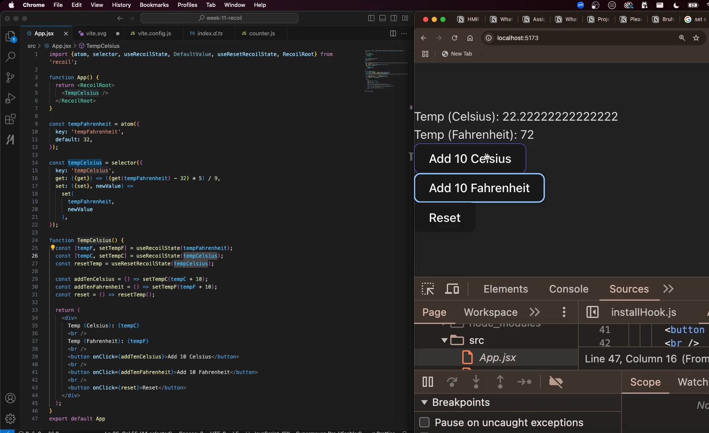

Learning __Recoil__ :One of many State Managemnet tool in react that prevents unencessary renders

Learn => node ::streams | we haven't covered much in core nodejs

someone found some bug : 

we have used useState hook to manage state, other ways to manage state : 
   -> Redux
   -> mobX
   -> zuStand
   -> Recoil

See the video : 

__RECOIL__ : A state management library that provides a way to mnagae global state with fine-grained control

global state : for linkedin like app : notification count, messages and the posts you see, trending etc. anything that is dynamic .
So, all dynamic bits are stored in state

Recoil minimises uneneccesary renders by only re-rendering components that depend on changed atoms

Key Concepts here are :  [these are two terms that recoil introduces - not in react]
   -> Atoms  : Unists of statte that can be read from and written to from any component
   -> Selectors  : functions that dervice state from or other services, allowing for computed state

RECOIL vs CONTEXT API  : DO COUNTER CODE using both 

Atoms : [Recoil specific concept ] These are units of state that can be read from and written to from any component.When an atom's state change, all components that subscribe to that atom will re-render

MAIN FILE : App_2.jsx

REvision ke liye App_3.jsx mein firse khud likha

PRACTISING WHAT I LEARNT TILL NOW :- 

<!-- import {RecoilRoot, useSetRecoilValu, useRecoileValue, atom} from "recoil"

import counterAtom from "../store/atoms/counter"

const counterAtom = atom({
   key : "counter",
   default : 0
}) -->

-------------CONTINUING FROM HERE-----------------------
In context : context API changes everything re-renders
but when atom changes only the components subscribed to its state will re-render. 

When context API state changes then everythign that is contained inside the context provider re-renders

BUT in Recoil when atom changes only thing that is subscribed to the state of that atom re-renders. Then we will see selectors, so only thing subscribed to selectors re-renders

and there are more benefits but we will come them later

structure of our counterApp : 

So, our recoil provides us three main hooks :-
   -> useRecoilValue     : to subscribe to the value of the state   : triggers re-render
   -> useSetRecoilState  : to get the setters for the state         : do not trigger re-render 
   -> useRecoilState     : to get the value and setters both        : triggers re-render

Let's proceed to edge case 
  -> Some of benefits we can reap without recoil as well, we have been very harsh on useState() hook but we can make this more performant by using MEMO API
  -> __ASSIGNMENT__ : go through a blog post in lecture slides about : react-components-when-do-children-re-render

  -> ONE HIDDEN THING TILL NOW : Whenever a component re-renders all its children components re-render, we cannot avoid that unless we use Memo API. 

  -> lets see in a code file : App_4.jsx

-------------------------------------------------------------------------
SELECTORS in RECOIL -------------------------------------------------------------------------

A selector represents a piece of derived state. You can think of derived state as the output of passing state to a pure function that derives a new value from the said state.

[_PURE FUNCTIONS : It is a function that for a given input always gives you same output_]

Derived state is a powerful concept because it lets us build dynamic data that depends on other data.

So, when subscribed to context you cannot be pointing to a particular state of context and then monitor renders accordingly [you can do in a wiered way by breaking your context in parts, which will be hard to keep doing that, harder to read ans subscribe to some parts of context ]. But in recoil you can creat a global atom having state variable 
then create selectors for that atom which are parts of it and components now will subscribe to selectors rather than atoms

SO you cannot make changes to the derived states, but it updates itself if the atom changes

   => App_5.jsx

  :  ANSWER => There is concept of tree shaking, this means if you are selecting just an atom or selector then you will get code of that atom or selector . It means ki agr ham apne code mein recoil mein se sirf atom or selector hi use krre hein to client k paas node_modules  mein atom or selector ka hi code ayga, that is also taken care of  by some libraries that only that part will be sent to client

Technically he is right, we send node_mdoules yes, unless library implements some optimisation like tree shaking ki aap jitni cheezen library se use krre ho utni hi ayngi usse jyaada kuch nhi

that is why when you have some library for tree shaking you should always do :-

improt {atom, selector} from " recoil "

instead of -> import * as Recoil from "recoil" and then using => Recoil.atom({})   => so now in this case it will think apko puri library chiye fir bundle size massively badh jaygaS

   => App_5.jsx

----------------------------------------------------------------------------
MAKING RECOIL ANALOGIUS TO REDUX STATE MANAGEMENT LIBRARY 
----------------------------------------------------------------------------

So, RECOIL has a store which contains two folders ->  atoms and selectors

and REDUX has a store which contains two folders -> reducers and actions

TODO -

1. first create some frontend project
2. Then we might learn ATOM FAMILY or SELECTOR FAMILY  : which you might not need for long time [but then suddenly you will be like hwo an I create atoms inside a for loop then you learn about ATOM family and SELECTOR FAMILY ]
   -> either you can learn theoritacally what it means and then implement in dummy prokect
   -> OR you build a project first and then when going advance later then you learn about 
   
3. Alternate Approach in Lecture SLides
4. Read thorugh this : 
5. See this : 
6. make medium website clone OR e-commerce website
7. learn about useCallback
8. see what project is this : 
9. Learn what is set inside the selector   =>    EXPLORE the CODE => 
10. Someone Created URL shortner very dope => 

REACT LOT TO DO : 
  -> TAILWIND TO LEARN
  -> BUNCH OF MORE HOOKS WE NEED TO LEARN 
  -> some advanced topics in react to do
  -> useTranshition( ) hook we need to do
  -> Build actual projects