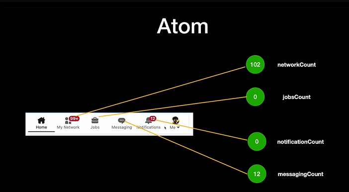
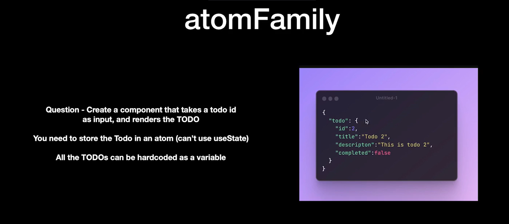
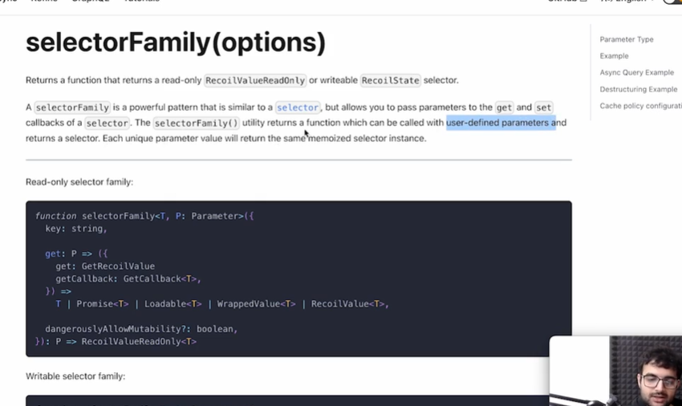
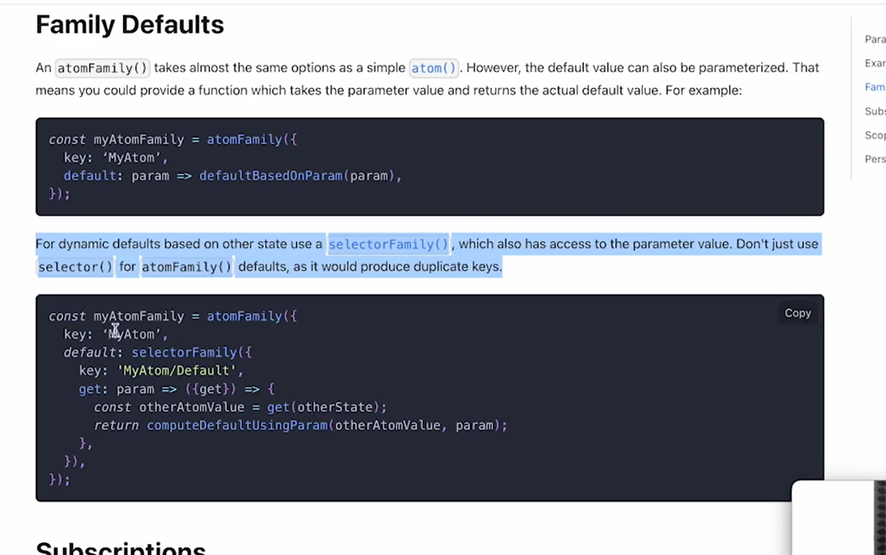
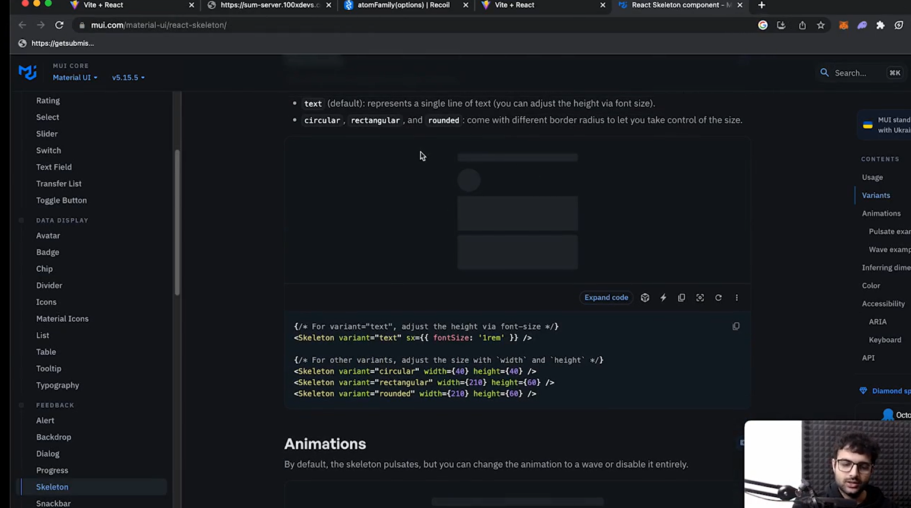
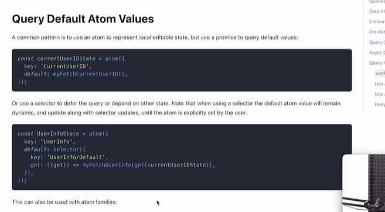

Recoil OFFLINE : DEEP DIVE
Clone the git repo : https://github.com/100xdevs-cohort-2/7.4

So, the topics that we will be covering today are :-
BASICS :
    -> Atoms                           : DONE : App_1.jsx
    -> Selectors                       : DONE : App_1.jsx 
    -> Asynchronous Data Queries       : DONE : App_3.jsx  -> used my own backend as harkirats link was not anymore working so go to => http://localhost:8000/notifications
    -> useRecoilState                  : DONE : App_1.jsx
    -> useRecoilValue                  : DONE : App_1.jsx
    -> useSetRecoilState               : DONE : App_1.jsx  
    -> someWhere in between used useMemo hook   : DONE  : App_2.jsx

ADVANCE :
    -> atomFamily                      : DONE : App_4.jsx and App_5.jsx
    -> selectorFamily                  : DONE : App_6.jsx and App_7.jsx
    -> useRecoilStateLoadable          : DONE : App_8.jsx and App_9.jsx
    -> useRecoilValueLoadable          : DONE : App_8.jsx and App_9.jsx

-> we will write logic to create 4 atoms

---------------------------------------------------------
ADVANCE RECOIL
---------------------------------------------------------

1. __Atom Family__
lets begin with a problem : you need more than one atom for your use case . Example : creating a todo application having multiple todos

2. __Selector Family__

In the Todo Application, lets say you are supposed to get TODOs from a server
   -> https://sum-server.100xdevs.com/todo?id=1  : THIS ISN'T WORKING NOW SO USE next one
   -> https://jsonplaceholder.typicode.com/posts/1

SelectorFamily => 

See this read it for selectorFamily topic => 

3. __useRecoilStateLoadable__  and 4. __useRecoilValueLoadable__: These are hooks
So, what happens when the values aren't loaded immediately ? 
for, example the TODOs that are coming back from the server ?
How can we show loader on screen when that happens rather than an empty state?

 So while an API call is hung, we want to show loader to the user :-
 so there are more ways to do so, like => SUSPENSE API you can use
 another => that is :-

 rather than doing => useRecoilState  you can use => useRecoilStateLoadable

 and now this useRecoilStateLoadable returns array of two things :
 [STATSobject, setValue]

 so __STATSobjetc__ > it has => {contents, state}

 so _contents_ contains the actual state value and _state_ contains if it is loading or not and the __setValue__ function is used to update the state value here

and even if you use useRecoilValueLoadable it pretty much gives same object with contents and state

so state has three values that it can have :
    -> loading
    -> hasValue
    -> hasError

-> hasError is one way of handling errors while backend calls fails and another ways are :-

-> Suspense and ErrorBoundaries  : Done in App_9.jsx

------------------ASSIGNMENT FOR THIS CLASS---------------------

TODOSSS :
  1. Read Recoil documentations for asynchronous data query
  2. Read this : 
  3. Add Error Boundary code in your last .jsx file : it is class based component 
  4. Learn about Suspense api in reactS