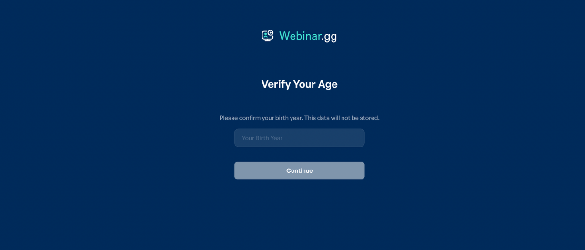
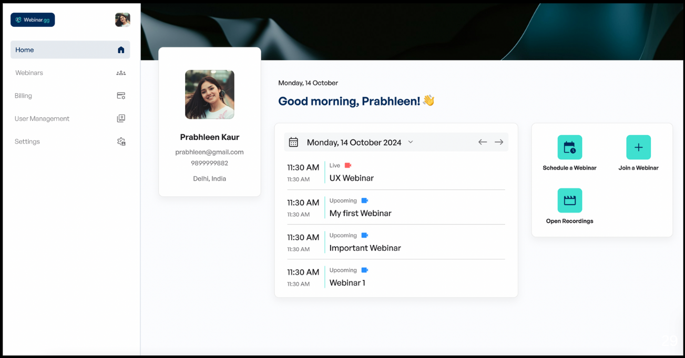

-----------------------------------------------------------------------------------------------------------
HOMEWORK 1  : folder /homework
-----------------------------------------------------------------------------------------------------------

using color extraction from image and getting my color pallete 

1. Screeen 1 : 

-----------------------------------------------------------------------------------------------------------
HOMEWORK 2  : folder /homework_more
-----------------------------------------------------------------------------------------------------------

using color extraction from image and getting my color pallete 

1. Screen 2 : 