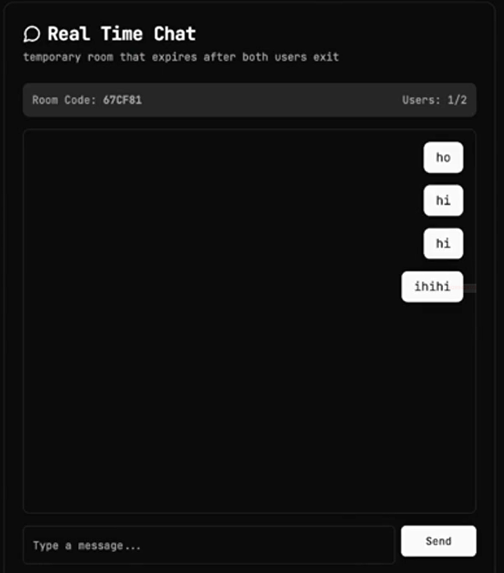
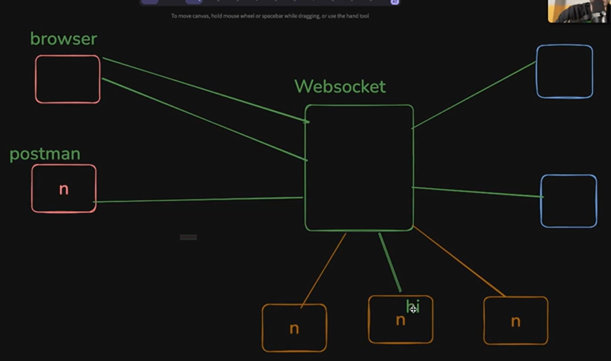
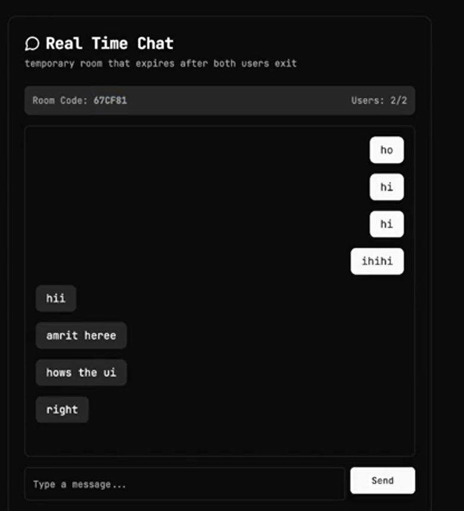
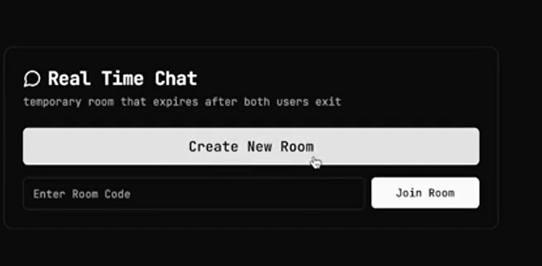
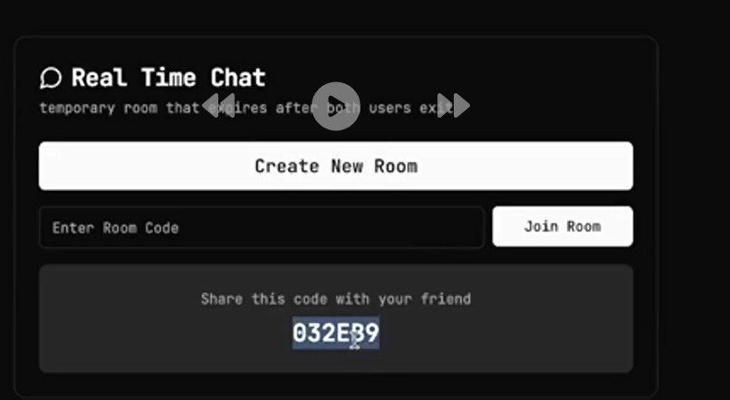
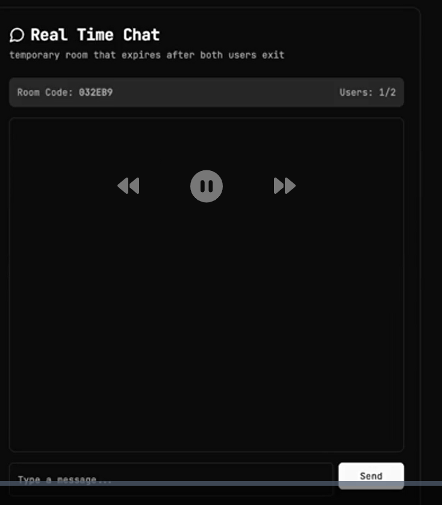

1. Today's Task : Build Chat App : 

We have done Ping Pong app yesterday : which also known as __HEARTBEAT__ functionality, to check if client is conenected to socket server or not. So after every say 1s client sends ping and if socketServer responds with pong, it means client side is live

CHAT difficulty : STEP WISE BUILDING
STEP 1 :  browser1 sends hie, then this hie message shoudl reach all broseres connected to the same websocket server [Broadcasting]

STEP 2 : Say you are part of room XYZ so, the broadcasting will happen to only those browsers which are of same room as XYZ. One WebSocket Server can have multiple rooms 

working on this chat app in folder : E:\COHORT 3.0\WebDev\projs\ChatApp\  OR view at github : https://github.com/AJbeetle/ChatApp-Websockets 

LEARN FROM OTHERS :-
1.
----------------------------------------------------------------------------------------------------
Guys a different method to broadcast the message to all the connected socket to server :
wss.on("connection", (ws) => {
console.log("Connected");

ws.on("message", (event) => {
const message = event.toString();
// Broadcast the message to all present connected clients
// wss.clients is provided by wss object to find the all the connected clients
wss.clients.forEach(client => {
client.send(message);
});
});

ws.on("close", () => {
console.log("User disconnected");
});
});

2.
----------------------------------------------------------------------------------------------------
I took that optimized approach:
import { WebSocket, WebSocketServer } from 'ws';

const wss = new WebSocketServer({ port: 8080 });

const arina = new Map<string, Set<WebSocket>>(); // Rooms and their members
/**
* {
* "room1" : "user/socket1", "user/socket2", "user/socket3"
* "roomX" : "user/socket78", "user/socket41",
* ...
* }
*/

const user = new Map<WebSocket, string>(); // Maps each user to a room
/**
* message: {
* type: 'chat' | 'join'
* text: 'any_chat_text' | 'roomName'
* }
*/

wss.on('connection', function connection(ws:WebSocket) {
// members.add(ws);
// ws.send(`total no of members: ${members.size}`);
ws.on('error', console.error);
ws.on('message', function message(data) {
const reqObj:any = JSON.parse(data.toString());
if (reqObj.type === 'join') {
const roomName = reqObj.text;

if (!arina.has(roomName)) {
arina.set(roomName, new Set()); // Create the room if it doesn't exist
}

arina.get(roomName)?.add(ws);
user.set(ws, roomName);

ws.send(`You are added to room ${roomName} successfully`);
}else {
const roomName = user.get(ws); // Get the room the user is in

if (roomName) {
arina.get(roomName)?.forEach(member => {
if (member !== ws) {
member.send(reqObj.text);
}
});
}
}
});

// Remove client on disconnect
ws.on('close', () => {
const roomName = user.get(ws);
if (roomName) {
arina.get(roomName)?.delete(ws);
if (arina.get(roomName)?.size === 0) {
arina.delete(roomName); // Remove the room if empty
}
}
user.delete(ws);
});
});

