Create a course selling app------------------------------------------------
1. Initialize a new Node.js project
2. Add Express, jsonwebtoken, mongoose to it as a dependency
3. Create index.js
4. Add route skeleton for user login, signup, purchase a course, sees all courses, sees the purchased courses course
5. Add routes for admin login, admin signup, create a course, delete a course, add course content.
6. Define the schema for User, Admin, Course, Purchase
7. Add a database (mongodb), use dotenv to store the database connection string
8. Add middlewares for user and admin auth
9. Complete the routes for user login, signup, purchase a course, see course (Extra points - Use express routing to better structure your routes)
10. Create the frontend

Good to haves----------------------------------------------------------------
1. Use cookies instead of JWT for auth     : DONE 
2. Add a rate limiting middleware          : DONE
3. Frontend in ejs (low pri)               : 
4. Frontend in React                       : 

Where do we store images in database ?
ans :  we never store images in the database, we store them in some other place called objectStores . So we store url of images in database [there is video for this : CREATING FULL SAAS APPLICATION IN 6 HOURS : watch that]

for any project build the backend first ALWAYS : always do the hard part of the project first 

Introducing Routing in Express

BENEFITS : all your route prefixes can be easily handled 
         : new routes or new version of old routes can be worked on by still running old routes 
         : makes code concise looking 

mongodb Compass is just gui that lets you see inside your database and perform operations over it 

Its like
 - mySQL gui
 - prisma studio
 - pgAdmin for pstgress

 TRY :  1. ejs                                                                                      : 
        2. cookie based authentication OR session based authenticayion                              : DONE
        3. write single middleware for users and admin but keep the jwt_secret different for both   : DONE
        4. write delete Courses endpoint in adminRoutes                                             : DONE
        5. add check in buying end point that user does not buy same course twice                   : DONE
        6. there should be an actual check if user has paid or not                                  : PAYMENT GATEWAY - LEARN LATER

nodemon : it is a cli which constantly watches our file so any chnages in it will reflect in our server code. So restarts backend server automatically

we need different jwt_secret for user and admin its because they both have different priviledges
 

W8_Offline ======================================

servers are transient but databasesare persistent
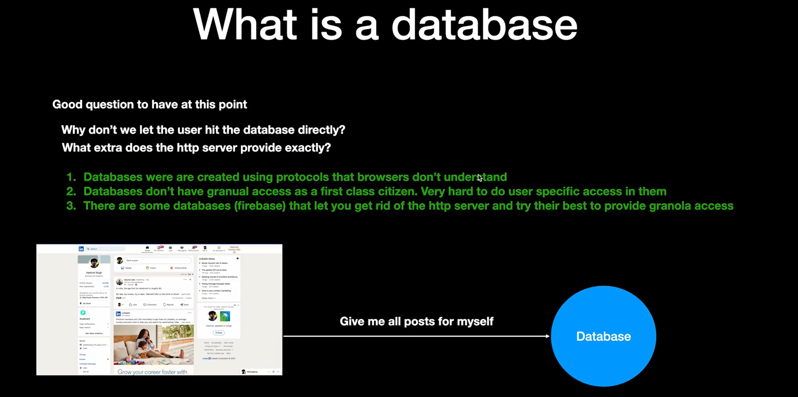

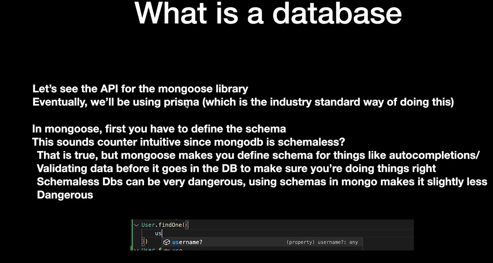

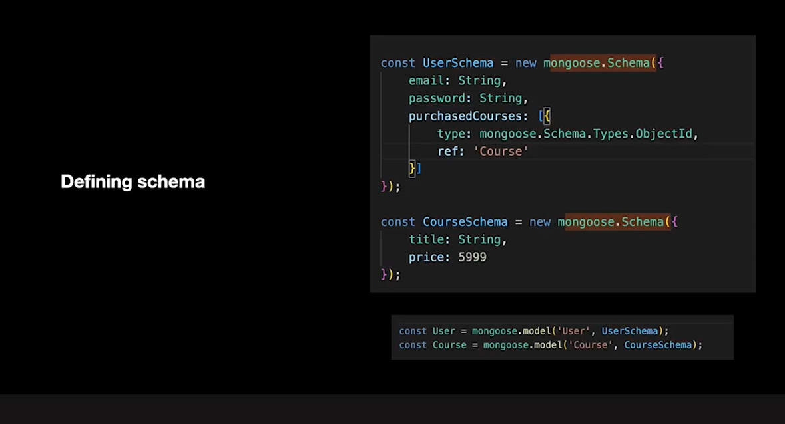

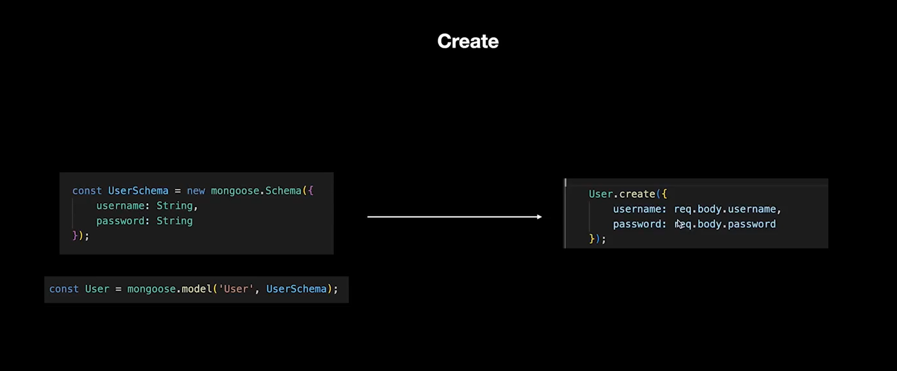

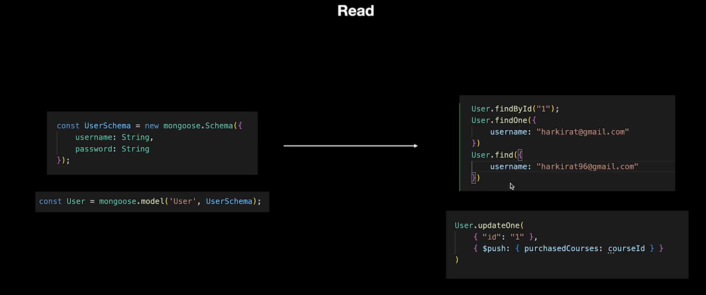

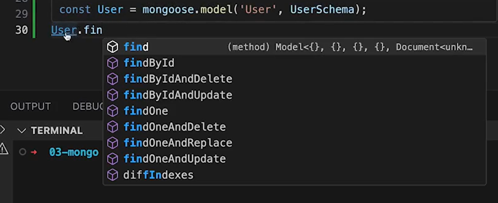

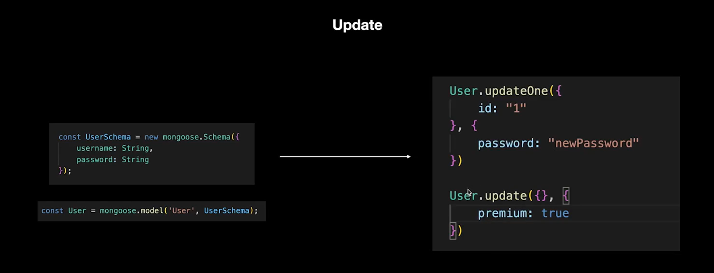

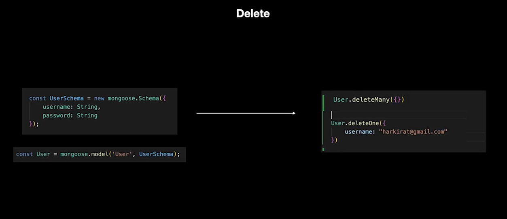

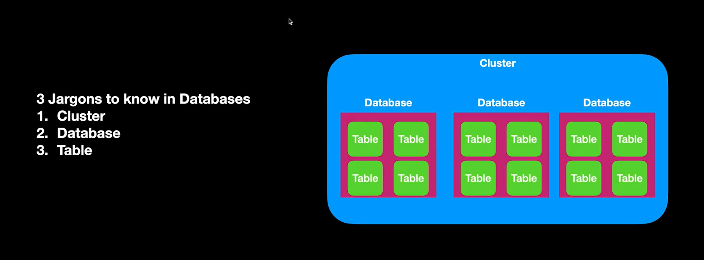

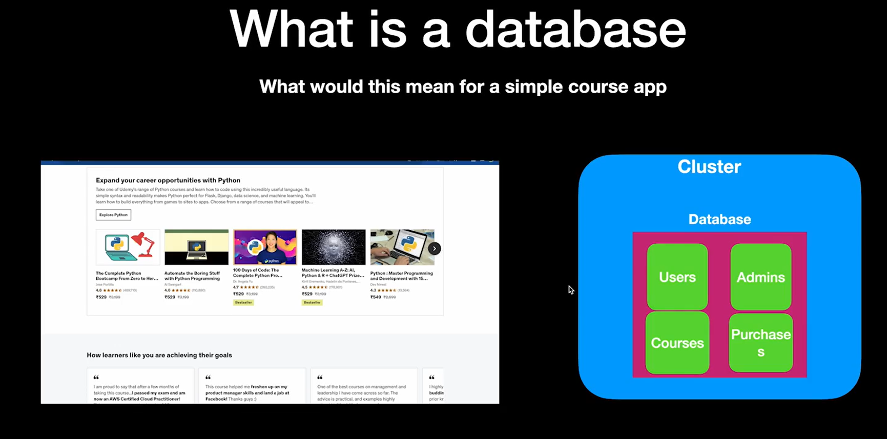

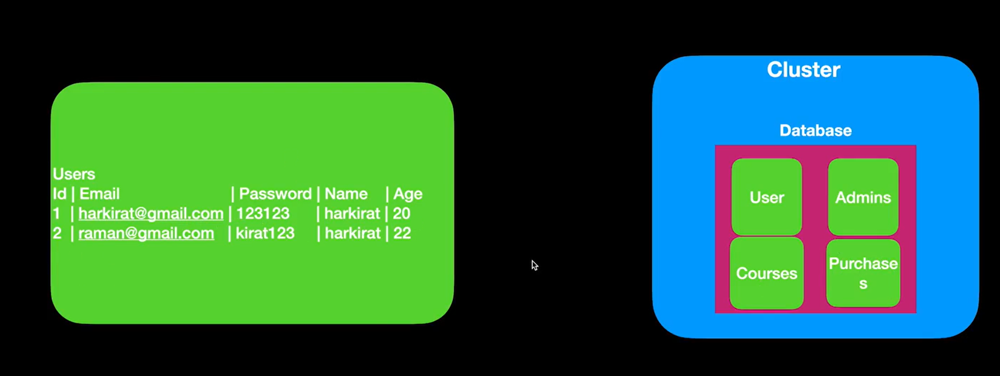
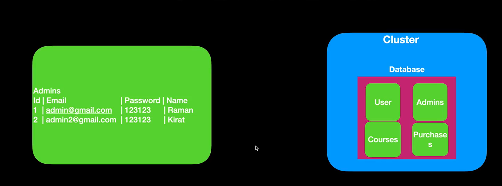
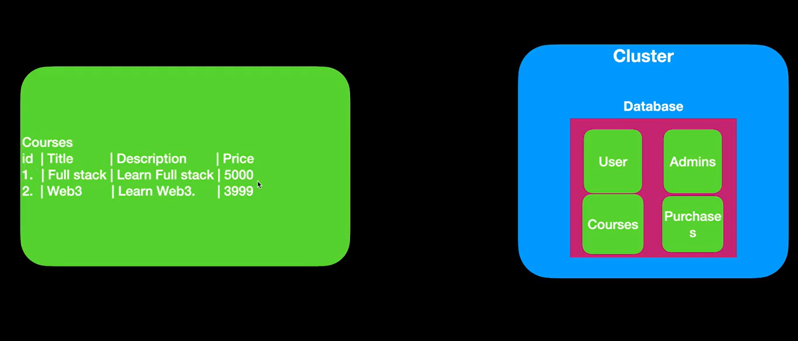
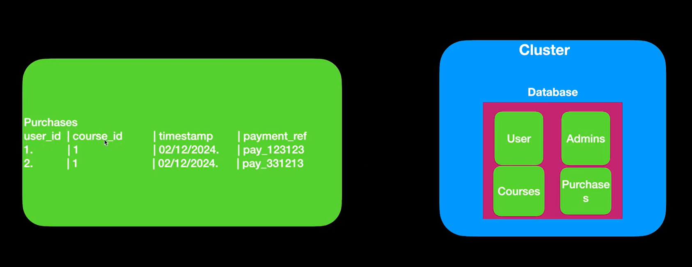

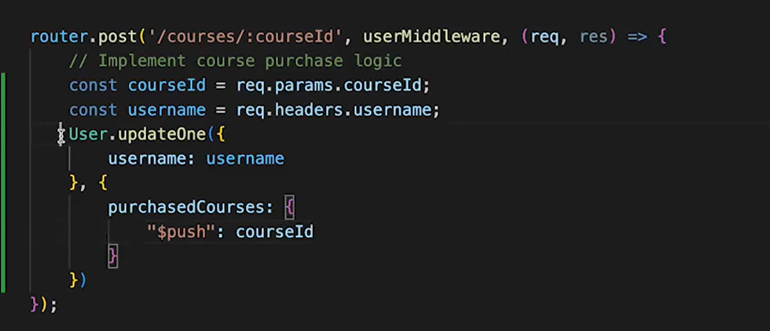

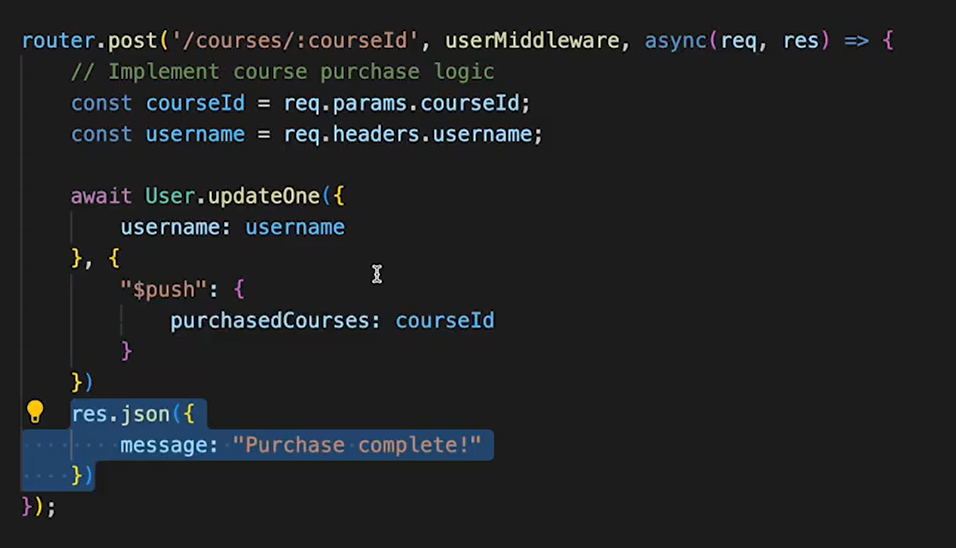

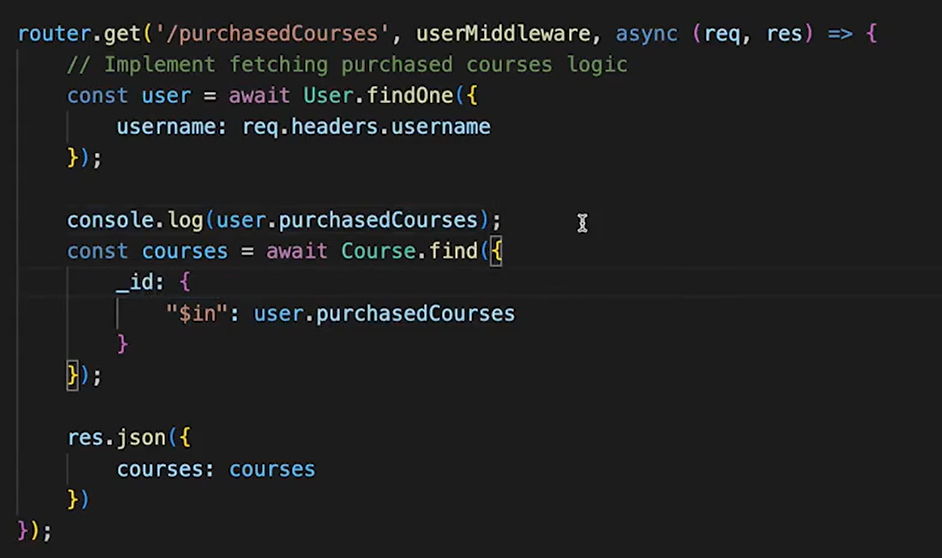

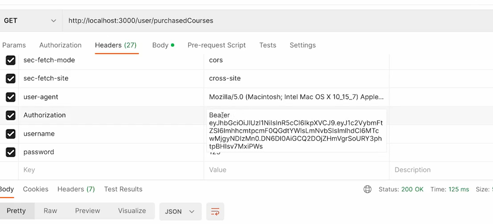

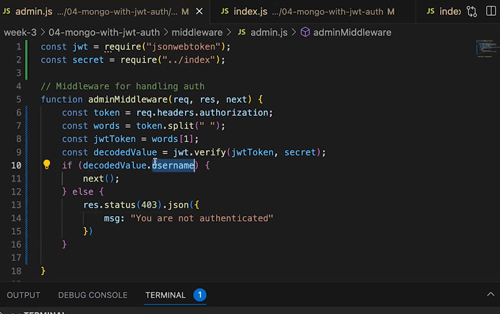

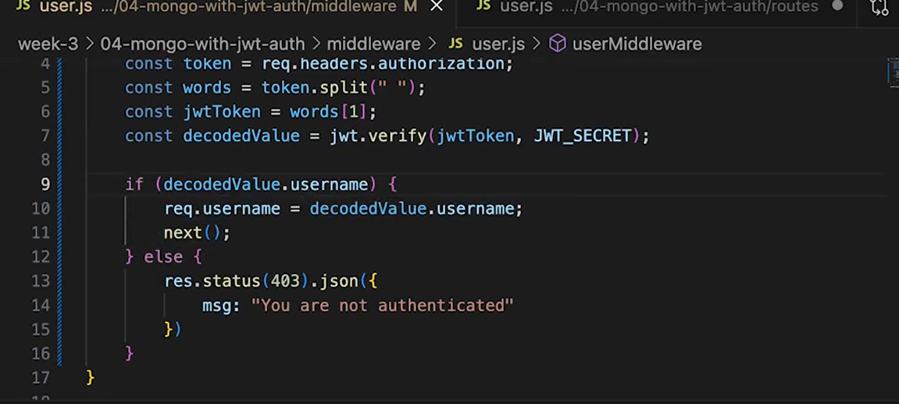