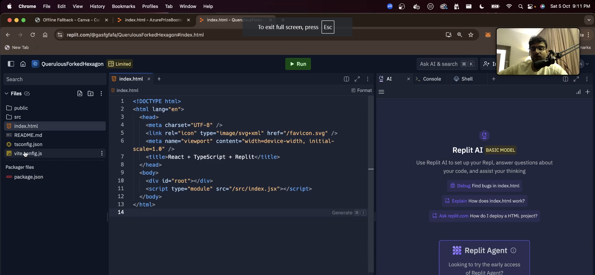
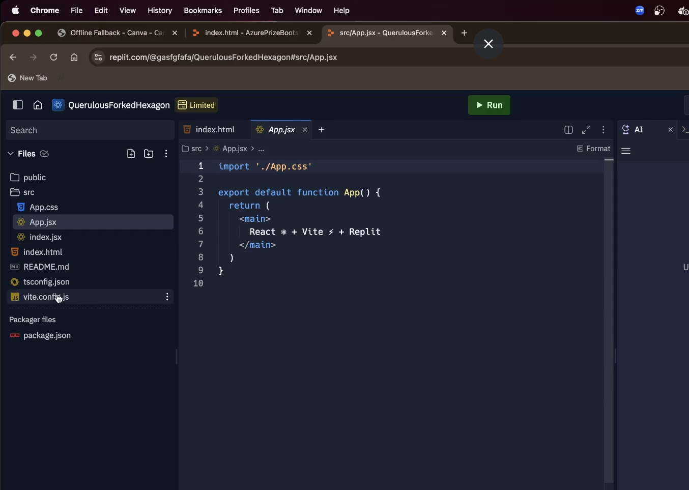
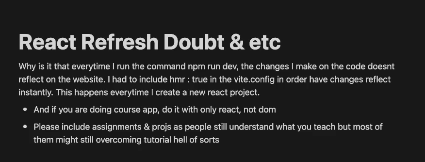

Here we will create our counter App

Screenshot of replit repo when you create new react app : 

another screenshot : 

we will understand all this tomorrow

So we will create only single file : app.jsx inside src folder

///////////////////////////////////////////////////
IN REACT LEARN THESE  - more deeper concepts
1. RECONCILIATION
2. RE_RENDERING
3. BULK RENDERING
4. What is meant by destructuring
5. Context API
6. PROP DRILLING
7. Diffing
8. Virtual DOM
9. BULK UPDATES
10. array destrcturing and object destructuring
11. propDrilling
12. UseContext
13. context API
14. 
////////////////////////////////////////////////////

->Let's do todo App in React : ./src/app2.jsx

reRender only happends when setState variable and we pass a new value in there, if we pass the same array even with the increased length then it will compare and say ye to ek jesa hi lag rha hai [usko lagega ye to same pehle jesa hi dikh rha h, use pata hi ni lagega ki size change hogya hai] and will not reRender but when you pass newArray it takes it as different value as a whole and re renders 

some person doubt for vite.js

SEE this notion doc :

JOB requirements :
1. MERN : nest.js
2. python : Django fastAPI
3. GoLang : getting very popular 
4. React Native

Super 30 comeon guys
