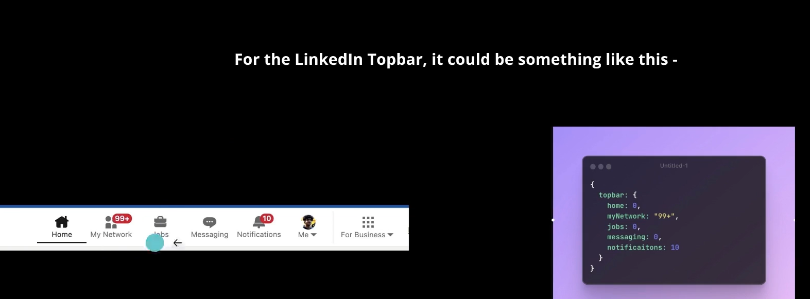
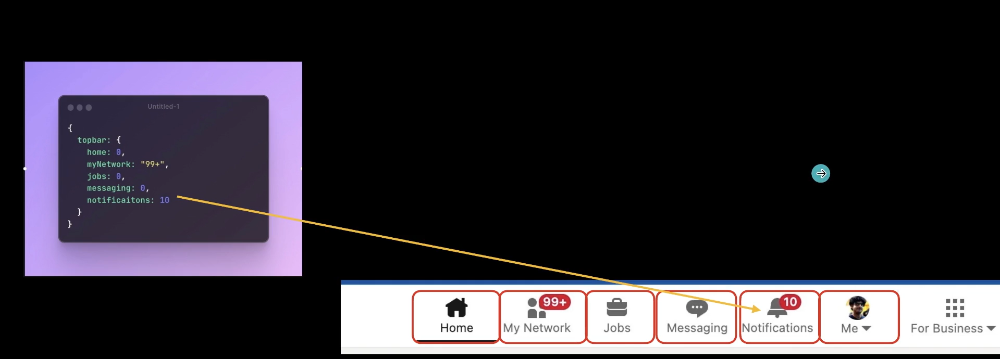
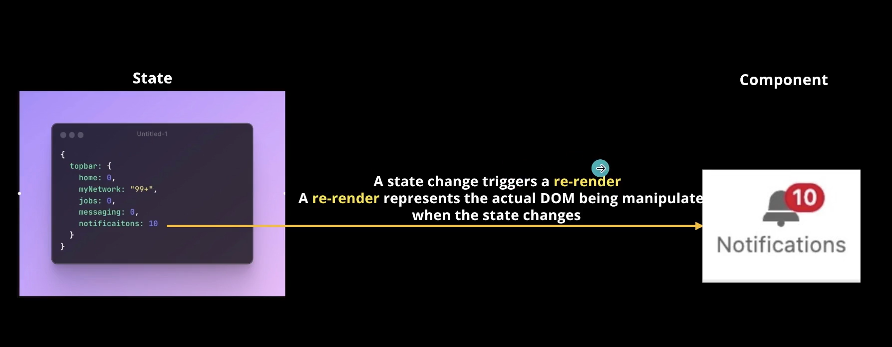
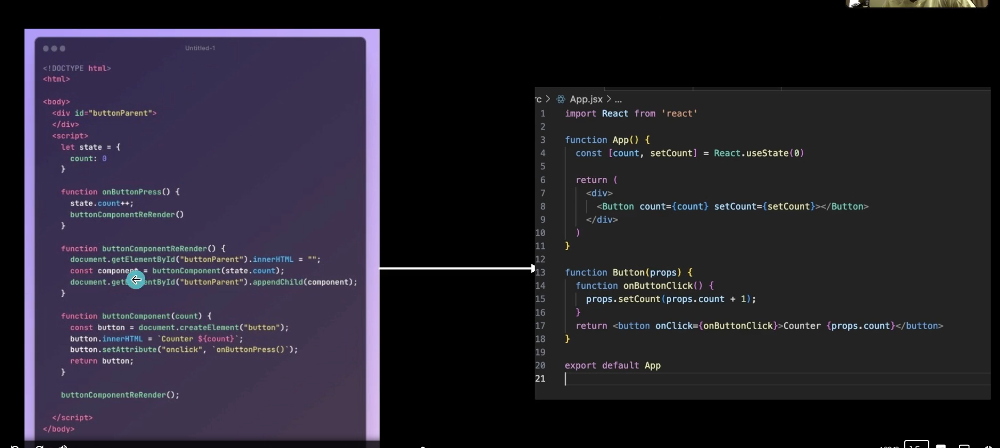
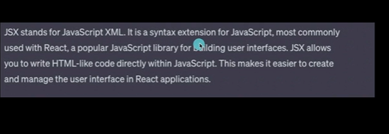

React Basics 

-> do you know about love babbar
We will learn 
1. What does react do
2. How does react work under the hood
3. Intuition about react, components and state 
4. 

Why do we need react ?
 -> for static websites we don't 
 -> when people realised that very big frontends need some framework as websites became very complicated [when facebook as application became very huge] -> so they built react and vue.js is also very similar

 -> Static Website means :  no content on the website is never changing 
 -> dynamic website : a website where components change as per users interactions or just by their database updates, as you scroll content is changing some html is getting added 

 -> for static websites you don't need framework, sometimes it is recommended to use jackile framwork for static rendering , don't complicate frontend don't increase your bundle Size

 -> for dynamic websites using frameworks is easier to manage, bundle size might increase but the developer headache is reduced 

 -> react is just an easier way to write html, css and JS code. It is a new syntax, that under the hood gets converted to HTML,CSS and JS

 REACT -------------npm run build------------> HTML, CSS and JS
 
 dom manipulation code is harder to understand and work with multiple people 
 but react code is readable and very understandable

 React code does not need to reach the user it is converted into HTML, CSS and JS
 and HTML, CSS and JS is what is deployed on AWS or on google cloud , we can ignore react code after that [it doesnot need to reach AWS server]

 just like ChatGPT is easy way to write react code 
 similarly react is an easier way to write HTML/CSS

 React is another way to write HTML, CSS and JS

 WHY REACT ?

 People realised DOM manipulation is harder to do in conventional way
 and several libraries and frameworks were made to make it easier like JQuery, BackboneJS which died eventually [because they were also hard to maintain bigger frontends] with the coming of react and vue.js as they created new syntax to do frontends
 Under the hood react compiler convert your code to HTML, CSS and JS
  
 
 
 

Problem with code written in index.ks

1. Too much code you have for such a simple functionality
2. as your app scale (todo aoo for eg) this gets harder and harder

So people switched to backbone js to handle this issue better then they switched to jquery 

and then react came and everything changed
  

SO NEXT PART OF LEARNING

DYNAMIC WEBSITES------------------------------------------------------
 -> to create a react app, you usually need to worry about two things
    1. State 
    2. Component
 -> you might have heard of component libraries in react  [like this is very famous component library]
 -> you might have heard of state management tools like recoil or redux
 -> so people have made frameworks above components and state too

 -> Creators of frontend frameworks realised that all websites can effectively be divided into two parts : STATE and COMPONENT

 STATE / COMPONENTS / RE-RENDERING ----------------------------------
  >> STATE 
     State is an JS object that respresents the current state of the app . It represents the dynamic things in your app (things that change ) for example the value of the counter

     [in index.js the number 0,1,2,3.... in counter button is state : so our website has only one state variable]

     anything that changes on the website is the state of the code 
     So state on linkedin : mynetwork, notifications, messaging, home

     this linkedin website has so many dynamic things so if we sit to discuss state object for linkedin it will be very big object having so many variables. So, just for the top bar the state object would look like : 

     why are breaking down our website to state and component : because react is written in such a way that if you update anything on this state object the changes will reflect on the frontend

     So, the whole frontend was broken down into two parts : because all the JS logic what will happen, what needs to change will come inside STATE PART and how it will be done will come inside the COMPONENT PART  

  >> COMPONENTS 
     how a DOM element should render, given the state . It is re-usable, dynamic, HTML snippet [not exactly HTML snippet] that changes given the state  also changes, so component re-renders

     
     

     

     rendering basically mean exporting 

     so, our dynamic part of website is written as separate code and static part as separate. So, react is basically effectively your DOM updation engine [it is as diff calculator]

     you usually have to define all your components once, and then all you have to do is update the state of your app, react takes care of re-rendering your apps

     lets do V0 cde of how react might have been written at low level. So creating counter app using state, component and re-rendering -> ./dynamciWebsite/index.html

     in your indexNew.html -> we learnt how react works under the hood => so equivalent code in react :  

     now starting => very basic react code starting smaall -> ./dynamicWebsite/basic.jsx

     jsx -> 

